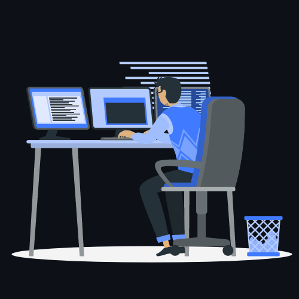

<h3 align="center">
    Hello world!&nbsp;
    &nbsp;Welcome to My profile!
</h3>

  

  
  &#8287;&#8287;&#8287;&#8287;&#8287;
  
  &#8287;&#8287;&#8287;&#8287;&#8287;
  
  &#8287;&#8287;&#8287;&#8287;&#8287;
  
  &#8287;&#8287;&#8287;&#8287;&#8287;
  
  &#8287;&#8287;&#8287;&#8287;&#8287;
  
  &#8287;&#8287;&#8287;&#8287;&#8287;
  

 

 
 

<h3 align="center">Languages</h3>

&nbsp;&nbsp;&nbsp;&nbsp;&nbsp;&nbsp;&nbsp;&nbsp;&nbsp;&nbsp;

<h3 align="center">Softwares</h3>

&nbsp;&nbsp;&nbsp;&nbsp;&nbsp;&nbsp;

<h3 align="center">Databases</h3>

&nbsp;&nbsp;

<h3 align="center">🛠 My Expertise</h3>
<ul align="center" style="list-style:none;">
    <li>Linux System Administration</li>
    <li>AWS Cloud Architecture</li>
    <li>Cyber Security</li>
    <li>ERP Implementation (Odoo, ERPNext, Dolibarr, SAP, Oracle ERP, Microsoft Dynamics)</li>
    <li>IT Infrastructure Management (AWS Cloud, Active Directory, VPNs, Firewalls)</li>
</ul>

<h3 align="center">📈 Work Experience</h3>
<ul align="center" style="list-style:none;">
    <li>Head of IT at Logic School of Management (06/2022 - Present)</li>
    <li>Co-Founder & CEO at Littlemesh Lab (09/2018 - 11/2022)</li>
    <li>ERP Specialist at Seals Centre WLL (10/2021 - 05/2022)</li>
    <li>ERP Administrator at HUGS India Ltd (04/2021 - 04/2022)</li>
</ul>

<h3 align="center">💡 Certifications</h3>
<ul align="center" style="list-style:none;">
    <li>AWS Cloud Architect</li>
    <li>CompTIA Linux+</li>
    <li>Cyber Security</li>
    <li>Introduction to Artificial Intelligence</li>
</ul>

